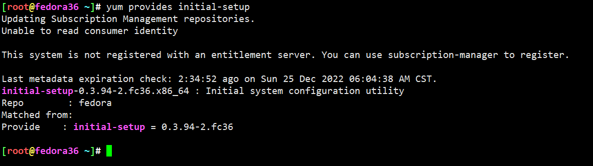
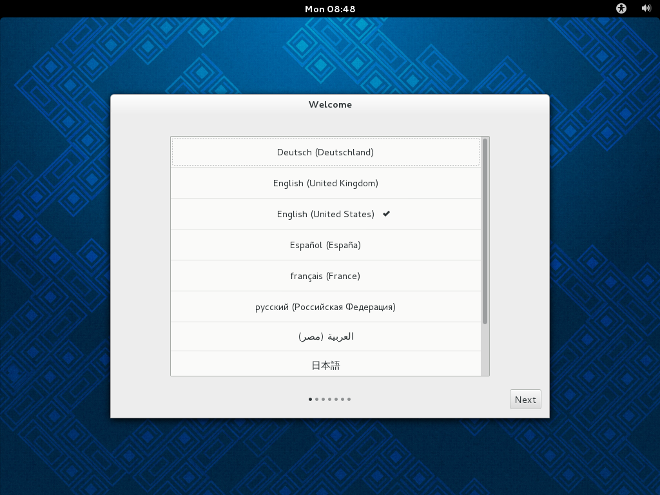

# firstboot行为

```
firstboot [--disable] [--enable] [--reconfig]
New in version Fedora3.

Determine whether the Setup Agent starts the first time the system is booted. If enabled, the initial-setup package must be installed. If not specified, the setup agent (initial-setup) is disabled by default.

optional arguments:

--disable, --disabled

The Setup Agent is not started the first time the system boots.

New in version Fedora3.

--enable, --enabled

The Setup Agent is started the first time the system boots.

New in version Fedora3.

--reconfig

Enable the Setup Agent to start at boot time in reconfiguration mode. This mode enables the language, mouse, keyboard, root password, security level, time zone, and networking configuration options in addition to the default ones.

New in version Fedora3.
```

* 安装过后第一次启动，行为，具体表现为：是否需要调用initial-setup
* 如果enable就是调用initial-setup，需要安装相关包才行，否则肯定爆炸啊
* 一般是，安装过程中没有配置普通账户，重启后调用initial-setup配置普通用户，其他没大鸟用
* reconfig就跟牛皮了，首先是enable，然后是配置的内容更多了，甚至可以覆盖ks中的配置，已经脱离ks控制，是initial-setup的行为了




```
[root@fedora36 ~]# rpm -qpl initial-setup-0.3.94-2.fc36.x86_64.rpm
/etc/initial-setup
/etc/initial-setup/conf.d
/etc/initial-setup/conf.d/10-initial-setup.conf
/usr/lib/python3.10/site-packages/initial_setup
/usr/lib/python3.10/site-packages/initial_setup-0.3.94-py3.10.egg-info
/usr/lib/python3.10/site-packages/initial_setup-0.3.94-py3.10.egg-info/PKG-INFO
/usr/lib/python3.10/site-packages/initial_setup-0.3.94-py3.10.egg-info/SOURCES.txt
/usr/lib/python3.10/site-packages/initial_setup-0.3.94-py3.10.egg-info/dependency_links.txt
/usr/lib/python3.10/site-packages/initial_setup-0.3.94-py3.10.egg-info/top_level.txt
/usr/lib/python3.10/site-packages/initial_setup/__init__.py
/usr/lib/python3.10/site-packages/initial_setup/__pycache__
/usr/lib/python3.10/site-packages/initial_setup/__pycache__/__init__.cpython-310.opt-1.pyc
/usr/lib/python3.10/site-packages/initial_setup/__pycache__/__init__.cpython-310.pyc
/usr/lib/python3.10/site-packages/initial_setup/__pycache__/common.cpython-310.opt-1.pyc
/usr/lib/python3.10/site-packages/initial_setup/__pycache__/common.cpython-310.pyc
/usr/lib/python3.10/site-packages/initial_setup/__pycache__/i18n.cpython-310.opt-1.pyc
/usr/lib/python3.10/site-packages/initial_setup/__pycache__/i18n.cpython-310.pyc
/usr/lib/python3.10/site-packages/initial_setup/__pycache__/initial_setup_log.cpython-310.opt-1.pyc
/usr/lib/python3.10/site-packages/initial_setup/__pycache__/initial_setup_log.cpython-310.pyc
/usr/lib/python3.10/site-packages/initial_setup/__pycache__/product.cpython-310.opt-1.pyc
/usr/lib/python3.10/site-packages/initial_setup/__pycache__/product.cpython-310.pyc
/usr/lib/python3.10/site-packages/initial_setup/common.py
/usr/lib/python3.10/site-packages/initial_setup/i18n.py
/usr/lib/python3.10/site-packages/initial_setup/initial_setup_log.py
/usr/lib/python3.10/site-packages/initial_setup/product.py
/usr/lib/python3.10/site-packages/initial_setup/tui
/usr/lib/python3.10/site-packages/initial_setup/tui/__init__.py
/usr/lib/python3.10/site-packages/initial_setup/tui/__pycache__
/usr/lib/python3.10/site-packages/initial_setup/tui/__pycache__/__init__.cpython-310.opt-1.pyc
/usr/lib/python3.10/site-packages/initial_setup/tui/__pycache__/__init__.cpython-310.pyc
/usr/lib/python3.10/site-packages/initial_setup/tui/__pycache__/tui.cpython-310.opt-1.pyc
/usr/lib/python3.10/site-packages/initial_setup/tui/__pycache__/tui.cpython-310.pyc
/usr/lib/python3.10/site-packages/initial_setup/tui/hubs
/usr/lib/python3.10/site-packages/initial_setup/tui/hubs/__init__.py
/usr/lib/python3.10/site-packages/initial_setup/tui/hubs/__pycache__
/usr/lib/python3.10/site-packages/initial_setup/tui/hubs/__pycache__/__init__.cpython-310.opt-1.pyc
/usr/lib/python3.10/site-packages/initial_setup/tui/hubs/__pycache__/__init__.cpython-310.pyc
/usr/lib/python3.10/site-packages/initial_setup/tui/hubs/__pycache__/initial_setup_hub.cpython-310.opt-1.pyc
/usr/lib/python3.10/site-packages/initial_setup/tui/hubs/__pycache__/initial_setup_hub.cpython-310.pyc
/usr/lib/python3.10/site-packages/initial_setup/tui/hubs/initial_setup_hub.py
/usr/lib/python3.10/site-packages/initial_setup/tui/spokes
/usr/lib/python3.10/site-packages/initial_setup/tui/spokes/__init__.py
/usr/lib/python3.10/site-packages/initial_setup/tui/spokes/__pycache__
/usr/lib/python3.10/site-packages/initial_setup/tui/spokes/__pycache__/__init__.cpython-310.opt-1.pyc
/usr/lib/python3.10/site-packages/initial_setup/tui/spokes/__pycache__/__init__.cpython-310.pyc
/usr/lib/python3.10/site-packages/initial_setup/tui/spokes/__pycache__/eula.cpython-310.opt-1.pyc
/usr/lib/python3.10/site-packages/initial_setup/tui/spokes/__pycache__/eula.cpython-310.pyc
/usr/lib/python3.10/site-packages/initial_setup/tui/spokes/eula.py
/usr/lib/python3.10/site-packages/initial_setup/tui/tui.py
/usr/lib/systemd/system/initial-setup-reconfiguration.service
/usr/lib/systemd/system/initial-setup.service
/usr/libexec/initial-setup/firstboot-windowmanager
/usr/libexec/initial-setup/initial-setup-text
/usr/libexec/initial-setup/reconfiguration-mode-enabled
/usr/libexec/initial-setup/run-initial-setup
/usr/share/doc/initial-setup
/usr/share/doc/initial-setup/ChangeLog
/usr/share/doc/initial-setup/README.rst
/usr/share/licenses/initial-setup
/usr/share/licenses/initial-setup/COPYING
/usr/share/locale/ach/LC_MESSAGES/initial-setup.mo
...
/usr/share/locale/zu/LC_MESSAGES/initial-setup.mo

```




--
