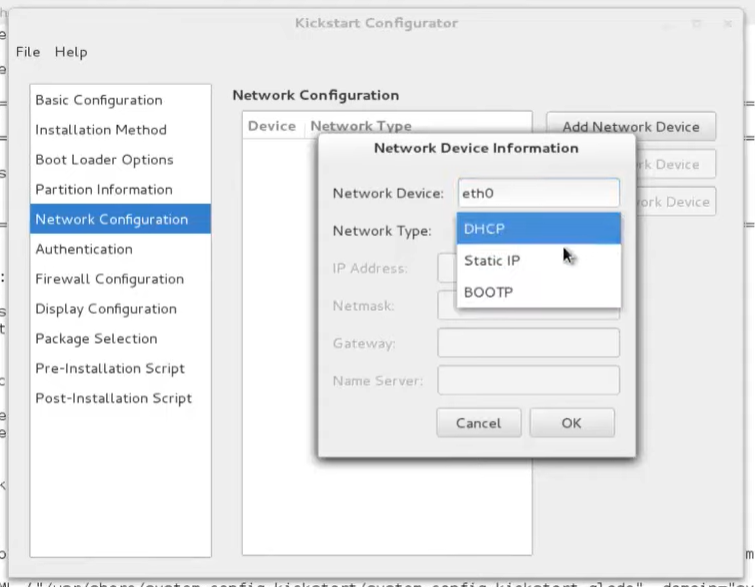

# ks生成工具-system-config-kickstart

## 参考

* <http://logiqwest.com/dataCenter/TechnicalPapers/KickStart/4._Enabling_KickStart_GUI%27s.htm>
* <https://github.com/rhinstaller/system-config-kickstart>
* <https://www.youtube.com/watch?v=EGBvtWEr65I&ab_channel=LinuxHelp>
* <https://www.howtoforge.com/automatic-and-up-to-date-fedora-9-installations-with-kickstart-and-novi-p2>

---

copy config from anaconda-ks.cfg [%packages]

---
